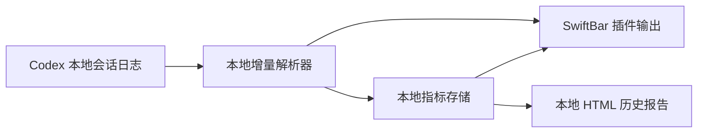

# Codex 本地延迟监控工具设计（V0）

## 1. 结论

采用 **SwiftBar 菜单栏插件 + 本地解析命令** 的组合：菜单栏负责随时可见的最新指标，本地命令负责增量读取 Codex 会话日志、计算指标和保存历史数据。

V0 是第一个可日常使用的版本，不是临时演示。它只解决“我这次 Codex 为什么慢”的可见性问题，不引入服务端、探针或账号配置。

## 2. 目标与边界

### 目标

- 被动读取本机 Codex 会话日志，不向模型服务额外发请求。
- 在菜单栏显示最近完成的一轮的 TTFT 与 TPS。
- 下拉菜单展示最近 10 轮、当天汇总和异常状态。
- 全部数据保存在本机；网络断开、VPN 变化都不影响采集器运行。
- 支持重启、日志追加和多个会话并发产生事件，且不重复统计。

### 不做的事

- 不做“工具时间扣减后的估计 TPS”。
- 不伪造逐 SSE token 的实时吞吐；本地 JSONL 没有每一个流式 delta 的到达时间。
- 不采集提示词、回答正文、工具参数或代码内容。
- 不修改 Codex 配置、不注入代理、不做主动网络探针。
- V0 不做远程服务、账号系统、跨设备同步和移动端通知。

## 3. 指标定义

指标以一个 Codex Turn 为单位。一个 Turn 是一条用户输入触发的完整 Agent 工作，从开始到完成或中止；其间可有多次模型请求和工具调用。

| 指标 | 展示名 | 定义 | 解释 |
|---|---|---|---|
| 首 token 等待 | TTFT | Turn 开始到首个模型 token 的耗时 | 最直接反映“发出请求后多久有响应” |
| 体感吞吐 | TPS | Turn 内模型输出 token 总数 ÷ 首 token 到 Turn 完成的时长 | 包含工具等待，反映用户实际等待中的产出效率 |
| 总时长 | Duration | Turn 开始到完成的时长 | 用于解释长任务和核对 TPS |

### 口径说明

- TTFT 优先采用 Codex 在 Turn 完成时写入的原生值；运行中出现首个 Agent 事件时可先显示“预估 TTFT”，完成后必须校正为原生值。
- TPS 使用日志记录的模型输出 token 总数。它不是“最终可见文字的逐字速度”：输出 token 可能含工具调用相关内容，且日志不提供每个 SSE delta 的时间戳。
- 有工具调用的 Turn 仍照常计算 TPS；工具等待保留在分母中。这是刻意选择，避免把“扣除工具后的估计值”误当作模型真实速度。
- 已中止、缺少 TTFT 或缺少 token 计数的 Turn 不参与汇总，列表中显示 `N/A` 和原因。

## 4. 用户界面

菜单栏默认只显示最新完成的一轮，保持低干扰：

```text
Codex · TTFT 2.8s · TPS 12.5/s
```

点击后展示：

- 最新 10 个 Turn：完成时间、会话简称、TTFT、TPS、总时长、是否包含工具调用。
- 今天的 p50 / p95 TTFT、p50 TPS、完成 Turn 数，以及 `N/A` 数量。
- 当前进行中的 Turn：已等待时长；出现首个 Agent 事件后显示预估 TTFT。
- “打开本地报告”：生成并打开只读的本地 HTML 历史页。
- “重新读取日志”：用于格式升级或异常后的手动恢复。

异常只用菜单栏图标和菜单内提示表达，不在 V0 默认弹系统通知。默认阈值为 TTFT 超过 10 秒或 TPS 低于 5/s；阈值在本地配置中可调整。

## 5. 承载方式与职责



| 部分 | 职责 | 运行方式 |
|---|---|---|
| 本地增量解析器 | 发现新日志、只解析新增完整事件、计算 Turn 指标、去重 | 由 SwiftBar 刷新时调用；也可手工执行 |
| 本地指标存储 | 保存解析位置、已完成 Turn 和日汇总 | 仅保存在 macOS 用户目录 |
| SwiftBar 插件 | 以约 10 秒间隔刷新菜单栏内容，并提供点击入口 | SwiftBar 的本地插件脚本 |
| 本地 HTML 报告 | 提供按日/会话查看的补充界面 | 仅在用户点击时生成和打开 |

V0 不启用常驻守护进程或 `launchd`：SwiftBar 的周期刷新已足够覆盖日常观察，运行复杂度更低。若后续需要秒级告警或长期趋势，再将解析器独立为 `LaunchAgent`，界面与指标口径不变。

## 6. 数据来源与处理规则

- 只读取 `~/.codex/sessions/` 下的会话 JSONL 文件。
- 解析器为每个文件保存已读取的位置和身份标记，只读取追加内容；遇到正在写入的不完整末行则留到下次处理。
- 每个 Turn 通过其稳定标识聚合开始、模型输出、工具调用、完成或中止事件。
- 只持久化指标和必要的定位信息：时间、会话匿名短标识、耗时、token 总数、工具调用布尔值、完整性状态。不会保存用户消息或模型文本。
- 日志格式变化或缺少必要事件时，当前 Turn 显示 `N/A`，同时保留原始文件位置供排查；不得用 `0` 代替缺失数据。

## 7. 目录规划

```text
codex-latency-monitor/
├── bin/                  # 本地解析与报告命令
├── plugins/              # SwiftBar 插件入口
├── test/fixtures/        # 脱敏的日志样本
└── docs/design.md        # 本设计文档
```

本地运行时数据不进入仓库，放在 macOS 用户应用数据目录；仓库只保留代码、脱敏样本和文档。

## 8. V0 验收条件

1. 对一份已完成的真实会话日志，显示的 TTFT 与日志内原生完成值一致。
2. 普通 Turn、含工具 Turn、中止 Turn、缺少 token 计数的 Turn 均有明确且不误导的展示。
3. 重复刷新、重启 SwiftBar、重新扫描历史日志不会产生重复 Turn。
4. 从菜单栏刷新到出现新完成 Turn 的延迟不超过一个刷新周期（默认约 10 秒）。
5. 断网、切换 VPN 或关闭 Codex 时，不会导致插件报错、卡死或发起外部请求。
6. 解析器不会读取或写入工作区文件，也不会修改 Codex 日志。

## 9. 后续演进（不属于 V0）

- 按模型、网络状态或工作区分组的趋势图。
- 连续异常后的 macOS 通知。
- 原生 SwiftUI 菜单栏应用，替代 SwiftBar 但复用本地解析器和存储。
- 导出匿名 CSV，便于长期对比 VPN、网络和模型配置变化。
