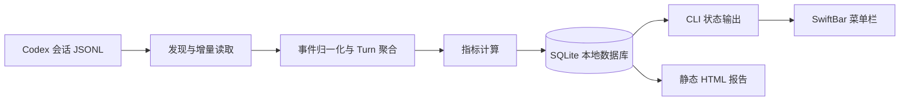
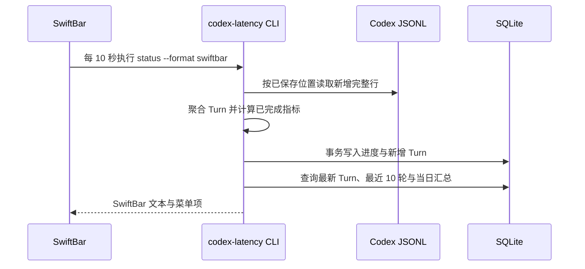
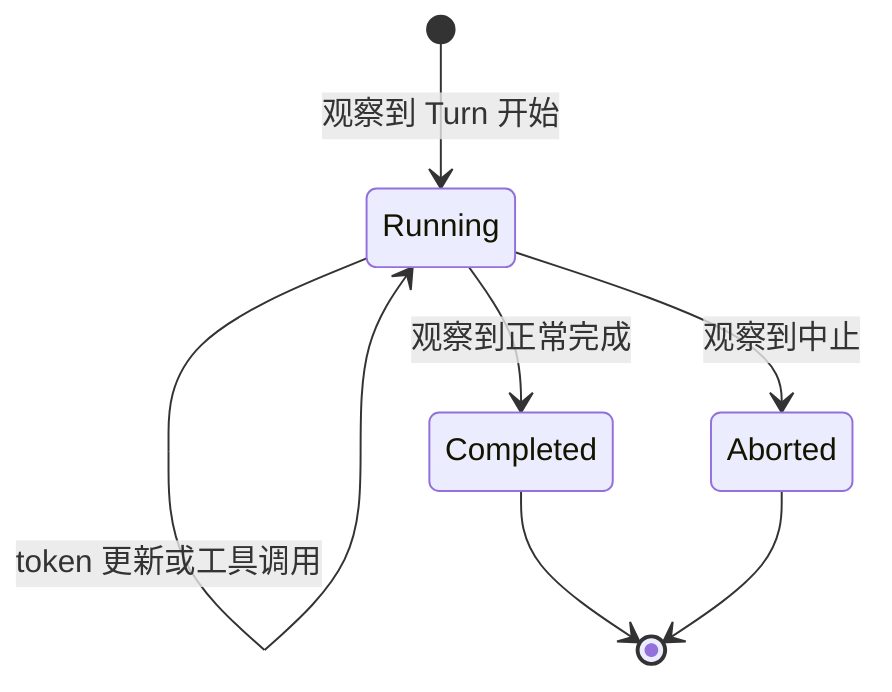

# Codex 本地延迟监控工具：技术设计

## 1. 背景与结论

本工具在 macOS 上被动读取 Codex 已落盘的会话 JSONL，提供菜单栏可见的 TTFT 和 TPS，用于区分“首个响应慢”和“整轮任务慢”。它不向模型服务发起任何探针请求，不修改 Codex 配置，也不上传会话数据。

技术选型确定为：**TypeScript + Node.js 22、better-sqlite3、本地静态 HTML、SwiftBar**。解析和指标计算是独立核心，SwiftBar 只是一个展示适配器；后续改为原生 SwiftUI 菜单栏 App 时，不需要重写采集逻辑。

## 2. 范围

### 2.1 V0 交付范围

- 增量读取 `~/.codex/sessions/` 下的 JSONL 会话文件。
- 计算已完成 Turn 的 TTFT、TPS、总时长和是否包含工具调用。
- 菜单栏显示最近完成 Turn，菜单展示最近 10 个 Turn 与当天汇总。
- 生成本地静态 HTML 历史报告。
- 持久化解析进度和历史指标，重启后不重复统计。
- 提供自动化单元、集成和端到端测试。

### 2.2 非目标

- 不计算或展示“工具时间扣减后的 TPS”。
- 不声称提供逐个 SSE delta 的纯模型生成速度。
- 不采集或存储用户问题、模型回复正文、工具输入输出、工作区路径。
- 不提供云端服务、跨设备同步、账号体系或主动网络拨测。
- 不在 V0 启动守护进程、`launchd` 或系统通知。

## 3. 指标与数据契约

一个 Codex Turn 是一次用户输入引起的完整 Agent 工作：从启动到完成或中止，期间允许多次模型调用和工具调用。

| 指标 | 计算方式 | 用途 | 限制 |
|---|---|---|---|
| TTFT | 优先使用 Turn 完成事件提供的原生首 token 耗时 | 判断首个响应是否慢 | 完成前仅可根据首个 Agent 事件给出预估值 |
| TPS | Turn 内每次模型输出 token 的增量总和 ÷ 从首 token 到 Turn 完成的时长 | 反映整轮工作的实际产出效率 | 分母包含工具等待；输出 token 不等于最终可见文字 token |
| Duration | Turn 开始到完成的时长 | 解释长任务与辅助排障 | 中止或字段不全时为 `N/A` |
| Tool flag | Turn 内是否观察到工具调用 | 为阅读指标提供上下文 | 不参与 TPS 扣减 |

TPS 的分母从首 token 开始，是为了避免把请求尚未返回任何内容的 TTFT 再计入输出阶段；工具调用及其等待会被保留。这样得到的是用户体感的有效吞吐，而不是被人为“加速”的估计值。

本地 JSONL 不保留每个 SSE delta 的到达时间，因此不实现“逐 token 流式 TPS”。日志格式缺少必要字段时，值显示 `N/A`，绝不使用 `0` 替代缺失数据。

## 4. 技术选型

| 层 | 选择 | 选择理由 | 不选择的方案 |
|---|---|---|---|
| 运行时 | Node.js 22 + TypeScript | 当前机器具备 Node 22；JSONL、CLI 与 SwiftBar 集成简单；类型约束便于维护解析器 | Shell：JSON 和状态机不易维护；Python：需要额外确定解释器来源 |
| 本地数据库 | SQLite + better-sqlite3 | 单文件、事务和唯一约束足以处理偏移、去重和按日汇总；适合个人本地工具 | Node 内置 `node:sqlite`：当前仍标记为实验性；JSON 文件：历史查询与原子去重会逐步复杂 |
| 命令行接口 | 自有轻量 CLI，不引入 Web 服务 | SwiftBar 周期调用即可，启动快、故障面小 | 常驻 HTTP 服务：V0 没有必要的端口、进程和生命周期成本 |
| 菜单栏 | SwiftBar 插件 | 安装后可直接运行本地脚本、展示菜单、开发量小 | Electron/Tauri：对单一指标展示过重；原生 SwiftUI：作为后续 UI 升级路径 |
| 报告 | 无依赖静态 HTML | 可离线打开、无本地端口、易导出和审计 | React/本地 SPA：构建复杂度与收益不匹配 |
| 测试 | Node 内置 test runner + 脱敏 fixture | 不引入测试框架运行时，适合 CLI、存储和输出协议测试 | 仅手工点菜单：无法覆盖重启、追加、去重和缺字段场景 |

依赖保持最小：运行时仅增加 `better-sqlite3`；TypeScript 及类型声明只作为开发依赖。所有与 SwiftBar 的交互使用标准输出文本协议，不依赖 SwiftBar 私有 API。

## 5. 总体架构



### 5.1 模块边界

| 模块 | 职责 | 不能做的事 |
|---|---|---|
| 文件发现器 | 找到候选会话 JSONL，并识别新增或轮转文件 | 不读取无关的 Codex 配置、日志或工作区 |
| 增量读取器 | 按文件进度读取新增的完整 JSONL 行，并保留不完整尾行 | 不修改源日志 |
| 事件归一化器 | 提取与 Turn、token、工具和完成状态有关的最小元数据 | 不保存消息正文和工具内容 |
| Turn 聚合器 | 将同一 Turn 的事件合并为可完成或中止的状态 | 不把工具调用当成新的 Turn |
| 指标计算器 | 按第 3 节口径生成 TTFT、TPS、Duration、Tool flag | 不做工具时间扣减 TPS |
| 存储库 | 原子写入进度、Turn 结果和当日查询所需数据 | 不向网络传输数据 |
| CLI / 报告 | 输出 SwiftBar 菜单文本、JSON 诊断数据或本地 HTML | 不直接耦合解析器内部状态 |

### 5.2 运行时序



V0 由 SwiftBar 触发刷新，不维持单独常驻进程。刷新周期默认 10 秒，因此新完成 Turn 在 0–10 秒内出现；若 SwiftBar 未运行，下一次手动 CLI 调用会补齐历史数据。

## 6. 日志解析与状态机

### 6.1 输入事件

解析器只关注以下类别的会话事件：

- Turn 开始；
- 模型 token 使用量更新；
- 工具调用；
- Turn 正常完成；
- Turn 中止。

事件名称、字段存在性和顺序均应视为可演进的本地格式。解析器采用“识别已知字段、忽略未知字段”的兼容策略；无法构成完整指标的 Turn 保留诊断状态但不进入 TPS 汇总。

### 6.2 增量与幂等

每个日志文件保存身份信息、已确认字节位置和可能残留的不完整尾行。处理步骤为：

1. 发现最近的会话 JSONL；
2. 对未读区域按换行切分，只处理完整 JSON；
3. 以稳定 Turn 标识归并事件；
4. 将进度、聚合状态和新完成 Turn 放进同一 SQLite 事务；
5. 仅在成功提交后推进文件位置。

文件被截断、重建或身份变化时，读取器从头重放该文件；数据库的 Turn 唯一性约束保证不会重复计数。JSON 解析失败的完整行会记录为格式诊断，后续行仍继续处理。

### 6.3 Turn 状态



- 运行中的 Turn 可在发现首个 Agent 输出后展示预估 TTFT；完成后以原生 TTFT 校正。
- 只有 `Completed` 且字段齐全的 Turn 进入日汇总。
- `Aborted` 记录其状态和总等待时长，TTFT/TPS 为 `N/A`，不会污染 TTFT p50/p95 或 TPS p50/p5。

## 7. 存储、隐私与故障恢复

运行时数据位于 `~/Library/Application Support/CodexLatencyMonitor/`：数据库、用户配置和生成的临时报告均在该目录。它们不加入 Git，不放在项目工作区。

数据库承载三类信息：

- 已读文件的增量进度；
- 不含正文的 Turn 指标记录；
- 解析版本与迁移记录。

隐私约束：

- 永不持久化用户消息、助手文本、推理文本、工具输入输出或工作区路径；
- 会话只保留不可逆的短标识用于同日区分；
- 报告中仅包含时间、指标和状态；
- CLI 不发起 HTTP 请求，所有依赖仅在安装阶段通过包管理器获取。

错误分级：日志暂时不存在、字段缺失、数据库锁定和格式升级均应转换为菜单内可读状态；插件必须仍输出有效 SwiftBar 文本，不能把堆栈直接打印到菜单栏。诊断日志只写本地应用数据目录，并轮转保留。

## 8. CLI、SwiftBar 与配置

CLI 是核心层的唯一入口，提供以下命令：

| 命令 | 作用 |
|---|---|
| `refresh` | 增量导入日志并更新本地指标 |
| `status --format swiftbar` | 刷新后输出菜单栏文本与菜单项 |
| `status --format json` | 输出脱敏诊断数据，供测试与排障使用 |
| `report` | 生成并打开本地静态 HTML 报告 |
| `doctor` | 检查 Node、日志目录、数据库和 SwiftBar 插件位置 |

SwiftBar 插件只负责调用相邻的已安装 CLI 并透传其标准输出。它不自行解析 JSONL，也不存储状态。默认菜单栏文本为：

```text
Codex · TTFT 2.8s · TPS 12.5/s
```

配置使用本地 JSON 文件，包含刷新周期、TTFT/TPS 异常阈值和报告保留策略。缺失配置使用安全默认值：10 秒、TTFT 10 秒、TPS 5/s。配置损坏时回退默认值并在 `doctor` 中报告，不中断菜单栏刷新。

## 9. 工程目录

```text
codex-latency-monitor/
├── src/
│   ├── cli/                 # CLI 参数与输出格式
│   ├── ingest/              # 发现、增量读取、事件归一化
│   ├── domain/              # Turn 状态、指标与纯计算函数
│   ├── storage/             # SQLite、迁移、事务与查询
│   ├── report/              # 静态 HTML 生成
│   └── swiftbar/            # 菜单文本格式化
├── plugins/                 # SwiftBar 安装入口
├── test/
│   ├── unit/
│   ├── integration/
│   ├── e2e/
│   └── fixtures/            # 脱敏、最小化 JSONL 样本
├── scripts/                 # 打包和本地 E2E 脚本
└── docs/
```

## 10. 测试方案

测试以“日志输入到菜单栏输出”的真实路径为主，避免只测内部函数。

### 10.1 单元测试

覆盖纯函数和边界条件：

- 完整 Turn 的 TTFT、TPS、Duration 计算；
- 含多段模型输出 token 的累计；
- 含工具调用的 TPS 保留工具等待，不做扣减；
- 缺少 TTFT、token 或结束时间时返回 `N/A`；
- 时间异常、零或负分母、未知事件类型；
- TTFT p50/p95 与 TPS p50/p5 的小样本、偶数样本和空样本；
- SwiftBar 文本转义与 `N/A` 展示。

### 10.2 集成测试

使用临时目录和临时 SQLite 数据库，覆盖：

- 首次导入、第二次空刷新和重复刷新均不重复生成 Turn；
- 追加一半 JSON 行后不读取，补齐换行后恰好读取一次；
- 文件截断或轮转后可安全重放；
- 同一轮中 token、工具、完成事件跨多次刷新到达；
- 数据库事务失败后不推进读取位置；
- 解析器不将 fixture 中的消息正文写入数据库或报告。

### 10.3 端到端测试

E2E 不依赖真实 Codex 或网络：通过环境变量把会话目录和应用数据目录指向临时目录，使用脱敏 fixture 模拟真实事件顺序。

| 场景 | 操作 | 预期 |
|---|---|---|
| 普通 Turn | 写入开始、token、完成事件，运行 `refresh` 和 `status` | JSON 与 SwiftBar 输出中的 TTFT/TPS 与预期一致 |
| 含工具 Turn | 插入工具调用及等待时间 | Tool flag 为真，TPS 未扣除工具等待 |
| 运行中 Turn | 仅写入开始与首个 Agent 事件 | 显示进行中和预估 TTFT，不进入日汇总 |
| 中止 Turn | 写入中止事件 | 列表状态正确，TTFT/TPS 为 `N/A` |
| 增量追加 | 分两次写入同一文件 | 第二次只处理新增完整行，无重复 |
| 插件协议 | 执行 SwiftBar 插件入口 | 首行和菜单格式合法，退出码为 0 |
| 隐私 | fixture 放入唯一敏感字符串后生成报告与数据库 | 该字符串不出现在数据库、JSON 状态或 HTML 中 |
| 离线 | 阻断网络环境运行 CLI | 全部命令正常完成，未产生外部请求 |

真实 SwiftBar GUI 不作为自动化前置条件：E2E 验证它所消费的文本协议；交付前再在已安装 SwiftBar 的 macOS 上执行一次人工验收，确认菜单刷新和“打开报告”动作。

### 10.4 质量门禁

每次提交至少运行：

```text
npm run lint
npm run typecheck
npm test
npm run test:integration
npm run test:e2e
npm run build
```

通过标准：全部命令退出码为 0；E2E 不读取真实用户会话；构建产物可由干净工作区生成；`doctor` 在未安装 SwiftBar 时给出明确安装提示而非失败。

## 11. 安装与发布方式

V0 以 GitHub 仓库交付。安装流程为：克隆仓库、安装 Node 依赖、构建 CLI、复制或链接 SwiftBar 插件到其插件目录、在 SwiftBar 中启用。`doctor` 提供一次性校验，验证 Node 版本、会话目录权限、数据库写入权限和插件位置。

Git 仓库不包含任何真实 Codex 日志、数据库、报告或本机路径。测试 fixture 必须为人工构造或彻底脱敏的最小样本。

## 12. 交付里程碑与完成定义

1. **设计完成**：本文档与指标口径固定。
2. **核心完成**：CLI 能对 fixture 与真实本地日志增量生成指标。
3. **展示完成**：SwiftBar 协议输出、最近 Turn 菜单和本地报告可用。
4. **验证完成**：第 10 节单元、集成、E2E 和一次 macOS 手工验收全部通过。
5. **发布完成**：代码、文档、脱敏 fixture 与测试提交到私有 GitHub 仓库，推送结果可复现。
