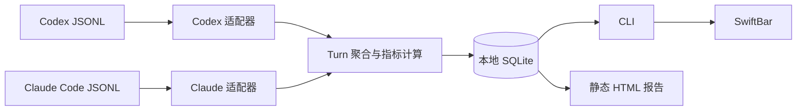

# Codex 与 Claude Code 本地延迟监控：技术设计

## 1. 结论

工具在 macOS 上被动读取 Codex 和 Claude Code 已落盘的 JSONL 会话，提供 TTFT 与 TPS。它不向模型服务发起网络请求、不改变两种客户端配置，也不上传会话数据。

技术选型保持为 **TypeScript + Node.js 22、better-sqlite3、静态 HTML 与 SwiftBar**。两个来源使用独立解析适配器，共享指标、持久化和展示层；后续替换 SwiftBar 为原生菜单栏应用时无需重写采集逻辑。

## 2. 指标契约

| 指标 | 计算方式 | 用途 | 边界 |
| --- | --- | --- | --- |
| TTFT | 用户提交到首个助手输出 | 定位响应前等待 | Codex 优先原生值；Claude 由本地助手事件重建 |
| TPS | 输出 token 总数 ÷ 用户提交到完成的总时长 | 反映端到端体感 | 包含 TTFT、工具、网络和思考等待 |
| Duration | 用户提交到完成 | 解释长 Turn | 无完整开始或完成时间时为 `N/A` |
| Tool flag | 是否观察到工具调用 | 辅助阅读 | 不从 TPS 分母扣除 |

本地日志没有可靠的逐 token 流式到达时间，因此不实现“纯输出 TPS”。缺失数据一律展示 `N/A`，绝不使用 `0`。

## 3. 架构



解析器只抽取时间、来源、会话 ID、token 计数、工具标记和完成状态。消息正文、推理文本、工具输入输出和工作区路径在解析时即被丢弃。

## 4. 两种日志适配器

### Codex

增量读取 `~/.codex/sessions/`，按稳定 Turn ID 归并开始、首个助手事件、token 更新、工具调用及完成/中止事件。完成事件中的原生 `time_to_first_token_ms` 优先于本地首个助手事件的回退值。

### Claude Code

增量读取 `~/.claude/projects/`，但跳过所有 `subagents/` 目录。一个符合条件的真实用户消息启动 Turn；assistant `end_turn` 结束该 Turn。解析时排除：

- `tool_result` 用户消息；
- `isSidechain`、`isMeta`、`isCompactSummary` 事件；
- 子代理会话文件。

首个 `thinking` 或 `text` 助手事件确定本地重建的 TTFT。相同助手消息 ID 的多次 token 记录取最大值，之后与其他消息相加，避免同一消息的增量/重复落盘造成双计数。Turn ID 带 `claude:` 前缀，保证不会与 Codex ID 冲突。

## 5. 增量、迁移与故障恢复

每个源文件保存已确认的字节位置，仅解析追加的完整 JSON 行；不完整尾行留待下次刷新。文件截断后从头读取，稳定 Turn ID 保证已完成记录不会重复统计。

升级到端到端 TPS 时，已有完成 Turn 自动按其保留的总时长和输出 token 重新计算一次。Codex 历史记录默认标记为 Codex，避免历史数据在报告中失去来源。

Claude 会话目录不存在时视为“尚未使用 Claude Code”，不显示错误，也不影响 Codex 刷新。未知事件与缺少必要字段的 Turn 保留为不可计算状态，不污染分位数汇总。

## 6. 展示协议

SwiftBar 每 10 秒通过安装时生成的 POSIX 启动器执行插件；启动器固定本次安装的 Node.js 运行时，避免 GUI 登录环境缺少 `PATH` 中的 Node。插件再调用 CLI，CLI 先刷新两种来源再输出：

```text
cx · gpt-5.6-sol · 7.8s · 21.2/s
```

最近 10 轮显示 `cx`/`cc`、模型、TTFT/TPS 数值与工具标记，但不重复展示指标名。当天汇总按“来源 + 模型”分组展示 Completed Turn 数、TTFT p50/p95、TPS p50/p5；缺少模型、TTFT 或 TPS 的 Turn 显示为 `N/A`。模型升级后重置本地读取偏移并回放 JSONL，以补齐历史轮次。

HTML 报告显示昨天零点至当前的两条时序图和最近 50 轮。折线按指标着色，采样点按来源显示 `● cx` 或 `◆ cc`；鼠标悬停显示来源、模型、完成时间和对应数值。

## 7. 隐私与安全边界

- 所有运行时数据仅位于 `~/Library/Application Support/CodexLatencyMonitor/`；
- CLI 不发起 HTTP 请求；
- 报告不包含会话正文、工具参数或工作区路径；
- 会话 ID 仅出现在本地 HTML 报告，菜单栏不展示；
- 任何无法形成可靠指标的数据展示为 `N/A`。

## 8. 测试方案

| 层级 | 覆盖内容 |
| --- | --- |
| 单元测试 | TPS 的端到端分母、缺失值和分位数边界 |
| 集成测试 | Codex 增量与工具等待、Claude 用户消息/工具循环/`end_turn`、消息 ID 去重、子代理与边车排除、模型采集/回放、来源图标与隐私 |
| 端到端测试 | 临时 JSONL → CLI JSON → SwiftBar 文本 → HTML 报告；验证最新来源、两个来源的列表、图表标记和悬停数据属性 |
| 安装器回归测试 | 临时 SwiftBar 插件目录；验证生成启动器、兼容旧版链接、精简 `PATH` 仍可运行，以及不覆盖非本工具插件 |
| 升级验证 | 以旧格式本地数据库启动，确认历史 TPS 自动切换为端到端口径 |

质量门禁：

```text
npm run lint
npm test
npm run test:integration
npm run test:e2e
npm run build
```

所有测试只使用临时目录和人工构造的脱敏 JSONL，不读取真实会话，也不依赖网络或 SwiftBar GUI。
